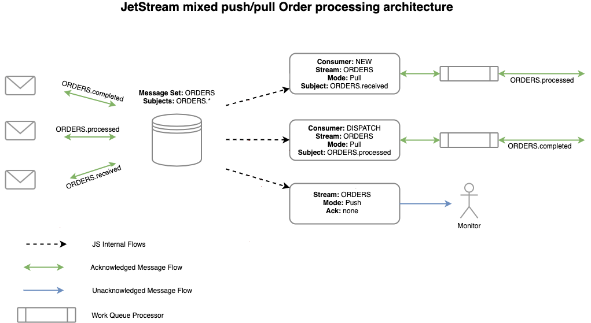

## Straight to the point

Let's try to program the prototype of the system shown in [the picture above](_logo/nats-streams-ordersimage.png).

Key points:
- Many related _subjects_ are stored in a _Stream_
- _Consumers_ can have different modes of operation and receive just _subsets_ of the messages
- Multiple _Acknowledgement_ modes are supported

Flow:
- A new _order_ 
    - arrives on ORDERS.received, 
    - gets sent to the **NEW** _Consumer_ who, on success, 
    - will create a new message on ORDERS.processed
- The ORDERS.processed message
  - again enters the Stream 
  - where a **DISPATCH** Consumer receives it
  - and once processed it will create an ORDERS.completed message
  - which will again enter the Stream
- All messages are delivered to a MONITOR Consumer
  - who pushes them to monitor

Acknowledgements:
- **NEW** and **DISPATCH** Consumers acknowledged all received messages to ensure no order is missed.
- MONITOR Consumer receives all messages without acknowledge.

You can find more details on [NATS Example page](https://docs.nats.io/nats-concepts/jetstream/consumers/example_configuration)

## Credits
The project is largely inspired by the very existence of [Nats client for php](https://github.com/basis-company/nats.php).

